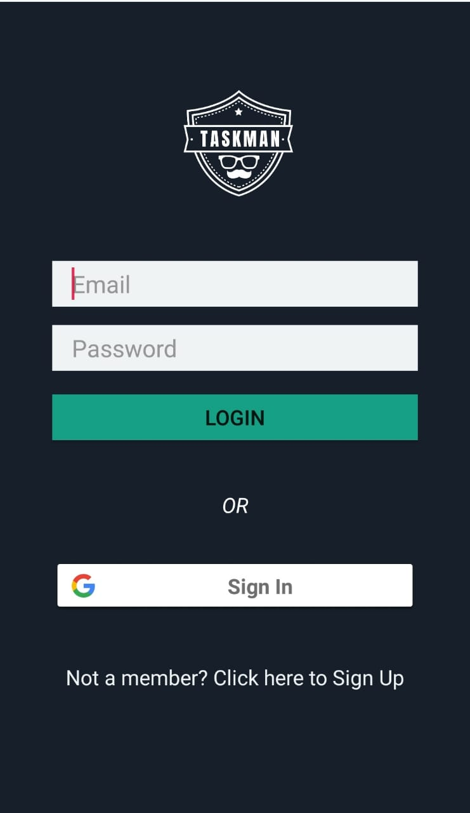
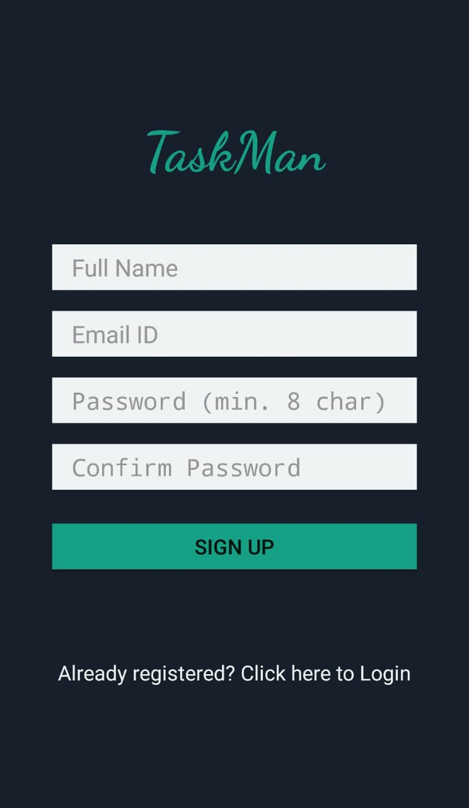
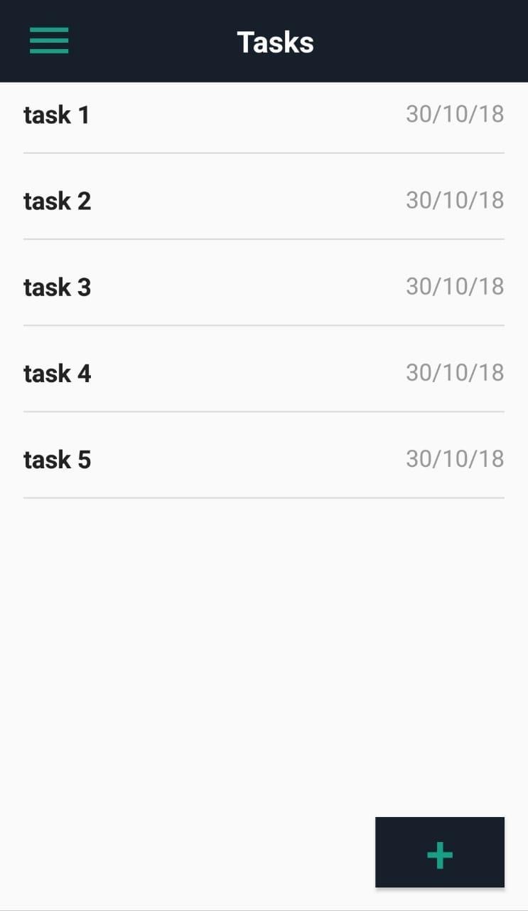
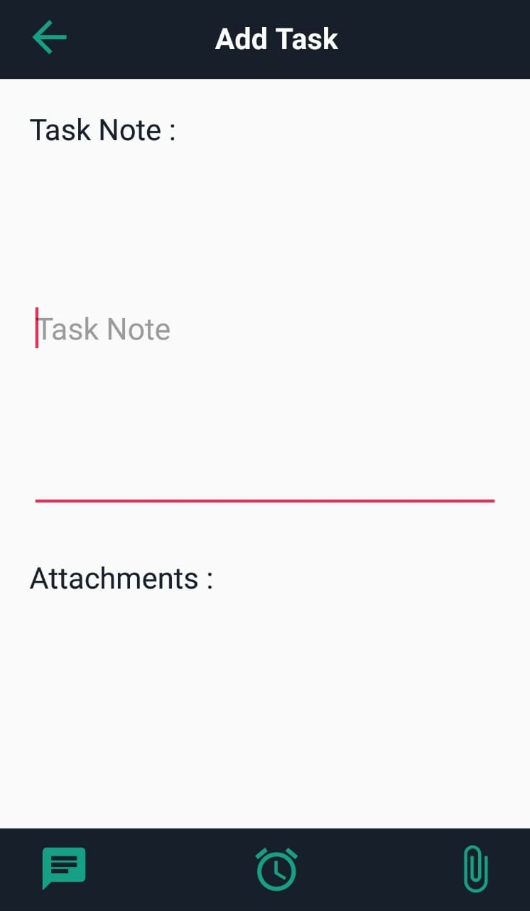

# TaskMan 
## Task Manager Android Application

TaskMan is an Android App where people can add tasks and manage them.The app would reminde people of each of their future tasks and alert them so that they dont miss it.

## Screenshots

	
	
	
	

## What does this app do?
It is an open source Android application that allows people to add their day-to-day tasks and manage them. 
Whether you’re sharing a grocery list, working on a project, preparing a group project or planning a vacation,TaskMan makes it easy to share your lists and collaborate with everyone in your life. It instantly syncs with your login account so you can access it from anywhere and reminds you so that you don’t miss important things in your life.

## Libraries this app uses:

1. Firebase - https://firebase.google.com/ 
2. Glide Image Loading - https://github.com/bumptech/glide
3. Android Support - https://developer.android.com/topic/libraries/support-library/

## Setup

1. Clone or download this repo.
2. This app uses Firebase as online database to store data. After cloning repo, import it to Android Studio.
3. Build and run the android application on the Android Studio to generate .apk file.
4. Copy this .apk file in your device storage and click on it to install the app.
5. That's it, you are ready to use the app !!

## Pre-requisites
1. Min. Android SDK 19
2. Android Build Tools v28.0.2
3. Android Support Repository

## App-Developers
<ul>
	<li><a href="https://github.com/aashish157">Aashish Raj Gupta</a>
	</li>
	<li><a href="https://github.com/Abhinavag1235">Abhinav Agarwal</a>
	</li>
	<li><a href="https://github.com/abhecreative">Abhishek Goyal</a>
	</li>
	<li><a href="https://github.com/harshup18">Harsh Upadhyay</a>
	</li>
	<li><a href="https://github.com/rahulasnani">Rahul Asnani</a></li>
</ul>
